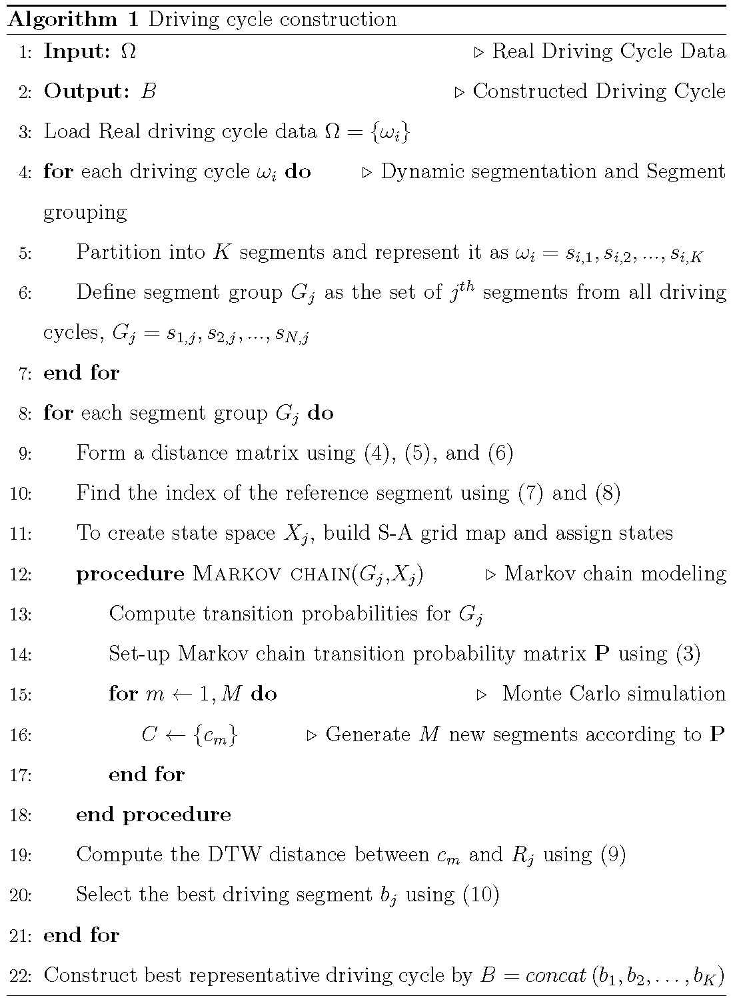

# Driving_Cycle

Driving_Cycle is a data-driven framework for generating and analyzing realistic driving cycles. This repository provides the necessary code and resources to implement the framework and utilize its features.

➡️ **Please note that the proposed method of code provided in this repository is currently under review for publication.**

## Features

-   Generation of realistic driving cycles using advanced techniques.
-   Incorporation of Markov chain modeling, Monte Carlo simulations, and Dynamic Time Warping (DTW).
-   Accurate representation of the complexity and stochastic nature of real-world driving behavior.

## Algorithm
Pseudo-code for the proposed algorithm.
<div align="left">
    <tr>
      <th></th>
    </tr>
</div>

## Dataset
The dataset provided in this repository consists of 19 driving cycles collected from the city of [Igdir, Turkey](https://www.google.com/maps/dir/39.9216343,44.0418135/39.9200546,44.0435517/39.9225889,44.0442167/39.9337557,44.0489844/39.9375393,44.079913/39.9372601,44.0802923/39.9043953,44.0609652/39.9193395,44.0416492/@39.9206967,44.0585684,14z/data=!4m2!4m1!3e0?entry=ttu). The driving cycles were recorded using an [On-Board Diagnostic II (OBD-II)](https://en.wikipedia.org/wiki/On-board_diagnostics) device installed in a 5-door vehicle. The data was acquired onboard using an Android device.
 
The driving cycles cover a route of approximately 11,150 meters, including two main arteries (D080 and E99 international trade routes) connecting Turkey to Asian countries. The dataset includes driving cycles during both peak and off-peak hours, as well as on weekdays and weekends, to reflect a variety of driving situations under diverse traffic congestion scenarios.

## Accessing the Data
To access the data, simply download the txt files available in the "[Data](https://github.com/for-reviewing/Driving_Cycle/tree/main/Data)" folder of this repository. The txt files contain time-speed profiles for each driving cycle, providing detailed temporal information about velocities, vehicle acceleration/deceleration parameters.

## Running the Code
The code provided in this repository implements a data-driven framework for the generation and analysis of realistic driving cycles.
1. Clone or download this repository to your local machine.
2. Follow the instructions provided in the code comments to input the necessary parameters and paths to the data files.
3. For MATLAB <a href="https://www.mathworks.com/">  </a>
   1. Set the data folder path
   2. Run "[main.m](https://github.com/for-reviewing/Driving_Cycle/blob/main/main.m)"
4. For Python: <a href="https://www.python.org/">  </a>
   1. Set the data folder path
   2. In Google Colab <a href="https://colab.research.google.com/">  </a>, Jupyter Notebook <a href="https://jupyter.org/">  </a>, etc., upload provided "[driving_cycle.ipynb](https://github.com/for-reviewing/Driving_Cycle/blob/main/driving_cycle.ipynb)" file and run the notebook cells.
* Note that in this study, segmentation is based on road characteristics. Segment sizes are given in the data folder as the "[sement_sizes.mat](https://github.com/for-reviewing/Driving_Cycle/blob/main/Data/segment_sizes.mat)" file. You can get different segment sizes by using different segmentation methods in your own work.
## Prerequisites
- To run the code, you will need Python with the necessary libraries installed. The required libraries for Python can be found in the "[requirements.txt](https://github.com/for-reviewing/Driving_Cycle/blob/main/requirements.txt)" file.
- MATLAB R2012a or later is required to run the MATLAB code.

## Usage
You are free to use the code and data provided in this repository for research, analysis and development. 
If you use the code or data in this repository in your work, please cite our article:
```diff
@Article{author2023,
  author  = {Author One, Author Two, Author Three},
  journal = {Under Review},
  title   = {A Data-Driven Framework for Driving Cycle Generation and Analysis},
  year    = {2023},
}
```
```diff
Author One, Author Two, Author Three (2023). A Data-Driven Framework for Driving Cycle Generation and Analysis. Under Review.
```

## License
The code and data provided in this repository are licensed under the MIT License. See the [](https://choosealicense.com/licenses/mit/)

# Contact
If you have any questions or feedback, please contact at: [authorone@gmail.com](mailto:authorone@gmail.com)
